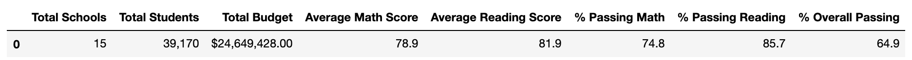

# School_District_Analysis

## Project Overview
A chief data scientist for a city school system is responsible for preparing all standardized test data for analysis, reporting, and presentation in order to provide insights on student performance. We have been tasked to aid in this analysis specifically regarding student’s standardized test scores in reading and in math – which we will then assess the funding, and other respective variables in relation to these results. This will entail and extensive report that showcases several high schools, each of their grades, and respective student’s performances and the accompanying trends in funding. 

## Purpose
The analysis we will provide the chief data scientist Maria, will be constructed using Python programming language in addition to the Jupyter Notebook software. Employing these program languages and software’s will allow us to better inform Maria and the inquiring school board on making decision regarding student performance and budget plans. The purpose is to aid the school board in their financial planning and offer insight into analytical patterns given students performances on their standardized tests. After showing maria and her supervisor the report we created, there has been reason to believe that an act of academic dishonesty has been conducted against the ninth grade reading and math scores in Thomas High School. Therefore, we will proceed with our report taking out these grades and comparing the results to observe how this affects the overall analysis.  

## Results
### School District Analysis with Thomas High School Grade 9 Scores 
The School District Summary provide the school board with insight into the overall performance levels and budget for the fifteen schools we are analyzing. As can be observed in the image attached below, we are analyzing at several key factors; total school budget, per student budget, average math and reading scores, the percentage of students passing math and/or reading, as well as the overall percentage of students passing. 
Collectively these schools are receiving a total budget of $24,649,428.00 alongside a total number of 39,170 students respectively. Looking towards the academic performance markers it can be determined that the average math score is 79.0% and the average reading score is 81.9%. Given these markers 75% of students in the district are passing math, 86% of students are passing English, and 65% of students are passing overall. 

### School District Analysis without Thomas High School Grade 9 Scores 
We can make the general assumption that the overall results have increased sigficatly due to the exclusion of the grade nine math and reading grades however, in order to provide insight into the school’s performance without these grades and its effects towards the general statistics it is important to look at a school summary, of which offers more specific insight. 

### School Summary Analysis with Thomas High School Grade 9 Scores 

**Average Math Score:** 78.9

**Average Reading Score:** 81.9

**% Passing Math:** 74.8

**% Passing Reading:** 85.7

**% Overall Passing:** 64.9

### School Summary Analysis without Thomas High School Grade 9 Scores 
**Average Math Score:** 83.350937

**Average Reading Score:** 83.896082

**% Passing Math:** 93.185690

**% Passing Reading:** 97.018739

**% Overall Passing:** 90.630324

By analysing the data provided above it can be determined that the removal of the grade nine grades did significantly alter the data. The average math and reading scores increased after the grades were removed and the same followed for the percentage of students passing these subjects and overall. Therefore, it could be concluded that the grade 9 data did present as a significant outlier to the analysis in this regard. 

## Analysis
Math and reading scores by grade: The grades 10-12 average math score did increase approximately 4%, the average reading grade increase approximately 2%, the % passing math increased approximately 19%, and the passing reading score increased 12%. Therefore, the overall passing also increased 25.7%

Scores by school spending: Excluding the ninth grade reading and math scores Thomas High School still performs as the highest school for percentage overall passing within its spending per student range. 

Scores by school size: This high schools is classified as a medium sized school which encapsulates between 1000-2000 students, relative to similarly populated schools Thomas High School performs at a similar rate yet receives the smallest amount of funding amongst other schools classified as medium sized. 

Scores by school type: Thomas High School is a Charter school, relative to other charter schools this high school performs significantly better than district schools, the data without the grade nine scores has not significantly affected this. 

## Summary
Therefore, it can be determined by the significant increase in all respects of the student's performances without the grade 9 grades that the grades received by this class did present as an outlier in performance, which could lead to the belief that there was some form of academic dishonesty practiced. Firstly, the most significant indicator of this is the 25.7% increase in the percentage overall passing. Secondly, the average reading and math scores only increased a small increment within 5% of the percent passing with the grade nine grades included however, this is followed by another significant increase in the percentage of students passing which appears unsettling. Lastly, if the average math and reading scores remained it appears odd that the following percentage of students changed so drastically, meaning that a large number of grade nine students were not successful in passing these subjects.
